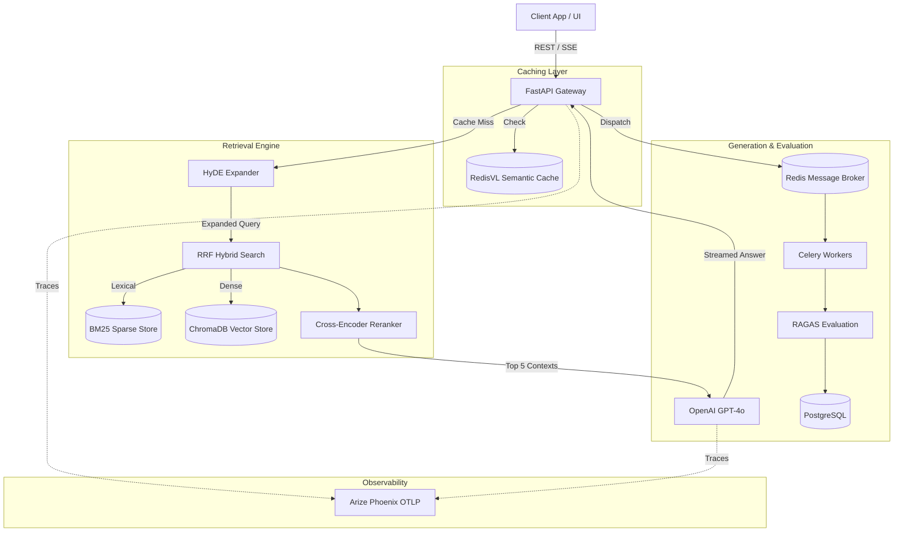
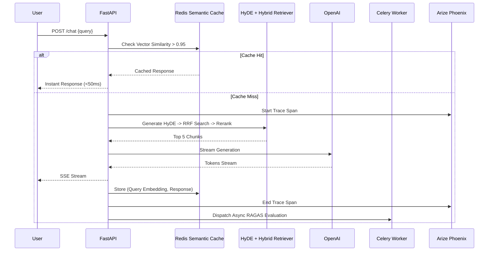

# System Architecture

## 1. Executive Summary
ScholarForge AI is an advanced, production-grade Retrieval-Augmented Generation (RAG) platform designed to ingest, process, and accurately answer complex queries against a massive corpus of Academic Research Papers. 

This document outlines the high-level system architecture, component boundaries, data flows, and the specific scalability strategies employed to elevate the project from a prototype to a highly-available enterprise application.

## 2. System Goals
*   **Latency:** P95 response generation under 1.5 seconds. Sub-50ms latency for repeated cached queries.
*   **Accuracy:** Context Recall > 80%, Faithfulness > 87% (measured rigorously via LLM-as-a-judge RAGAS).
*   **Scalability:** Capable of asynchronously ingesting 10,000+ multi-page PDFs without blocking the API event loop.
*   **Observability:** 100% tracing coverage for embeddings, retrieval, and LLM generation.

## 3. Design Principles
1.  **Cost-First Caching:** LLMs are expensive and slow. We intercept queries at the API gateway using Semantic Vector Caching before invoking the generative models.
2.  **Event-Driven Async:** Ingestion and evaluation are heavy CPU/IO tasks. They are completely decoupled from the main FastAPI server via Celery message queues.
3.  **Defense-in-Depth Retrieval:** A single retrieval method is insufficient for academic texts. We cascade from Query Expansion (HyDE) → Hybrid Search (Dense + Lexical) → Cross-Encoder Reranking.

## 4. Architecture Overview

## 5. Component Responsibilities

| Component | Technology | Responsibility |
| :--- | :--- | :--- |
| **API Gateway** | FastAPI | Handles REST routing, CORS, Auth, Rate Limiting, and streaming Server-Sent Events (SSE) back to clients. |
| **Task Broker** | Redis | Holds the queues for asynchronous ingestion and background RAGAS evaluation tasks. |
| **Worker Nodes** | Celery | Consumes tasks from Redis. Executes heavy PDF parsing, chunking, and LLM-as-a-judge scoring. |
| **Relational State**| PostgreSQL 15 | Acts as the source of truth for Document metadata, Session IDs, Conversation History, and Evaluation Scores. |
| **Vector State** | ChromaDB | Stores chunk embeddings (Cosine Similarity) and handles dense HNSW vector retrieval. |
| **Semantic Cache**| RedisVL | Stores vector representations of past queries to instantly return cached answers if similarity > 0.95. |
| **Tracing Server** | Arize Phoenix | Collects OpenTelemetry spans from the API and LLM to visualize latency bottlenecks and token costs. |

## 6. Sequence Diagram: The Query Flow

## 7. Scalability Strategy
*   **Stateless API:** The FastAPI nodes store zero state in memory. They can be scaled horizontally behind a load balancer infinitely.
*   **Worker Auto-scaling:** Celery workers can be scaled horizontally based purely on the depth of the Redis queue. During massive bulk uploads, worker replicas can spin up to handle the load.
*   **Vector Database Migration:** ChromaDB is currently used for local velocity. The repository is heavily abstracted (Repository Pattern) so that ChromaDB can be swapped for Pinecone or Milvus with zero changes to the business logic.

## 8. Failure Recovery
*   **LLM Outages:** If the primary OpenAI model goes down or rate limits, the system is designed to fallback to local open-source models (via Langchain adapters).
*   **Task Failures:** Celery tasks are configured with exponential backoff and retry mechanisms. If an ingestion chunk fails, it is placed in a Dead Letter Queue for manual inspection.

## 9. Key Tradeoffs
*   **Latency vs. Accuracy:** We chose to implement a Cross-Encoder Reranker (`ms-marco-MiniLM`). This adds ~300ms of latency to every cache miss. We accepted this tradeoff because academic querying requires absolute precision, and the Semantic Cache offsets the penalty for common queries.
*   **Complexity vs. Reliability:** Using Celery and Redis adds operational complexity compared to basic FastAPI `BackgroundTasks`. We accepted this tradeoff because `BackgroundTasks` run in the same memory space as the web server, which is an unacceptable risk for a production SaaS handling 100MB PDF uploads.
