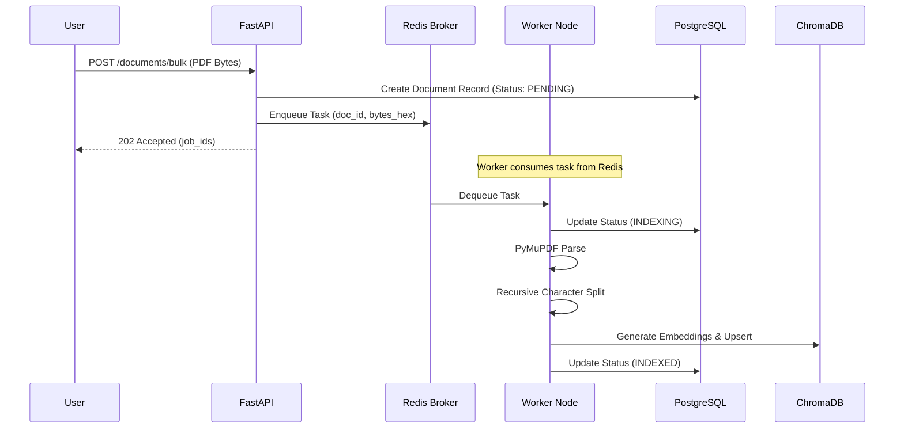
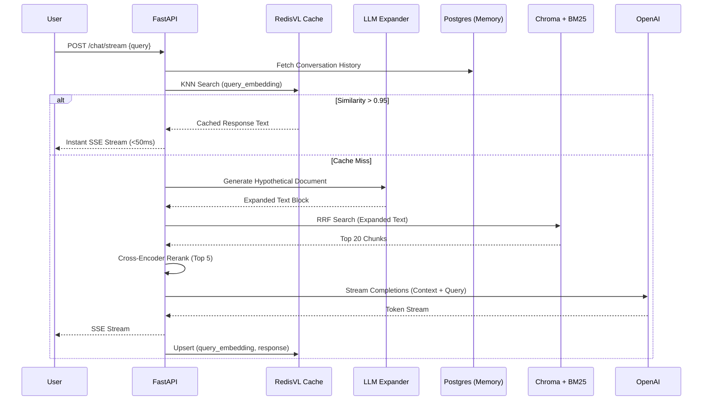
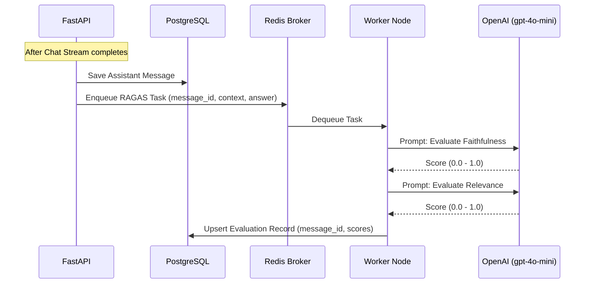

# System Data Flows

This document maps the exact flow of data through the microservice topology during critical system operations.

## 1. Document Ingestion Flow

This flow illustrates how massive PDF workloads are handled asynchronously to prevent blocking the web server.

## 2. Advanced Query Flow

This flow illustrates the defensive retrieval mechanisms and semantic caching strategy utilized to guarantee speed and relevance.

## 3. Asynchronous Evaluation Flow

This flow illustrates how automated LLM-as-a-judge (RAGAS) evaluation occurs without impacting user perceived latency.

