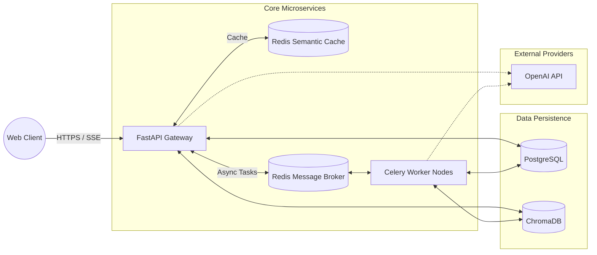

# System Design & Deployment Topology

## 1. High-Level Design (Context Diagram)

ScholarForge AI operates as a set of decoupled microservices, orchestrated via Docker Compose. This design guarantees that the web-facing API remains highly responsive, even when the system is processing heavy background workloads like document chunking or automated evaluation.

## 2. Low-Level Component Design

### 2.1 API Gateway (FastAPI)
*   **Routing:** Utilizes APIRouter to separate `/documents`, `/chat`, and `/metrics`.
*   **Dependency Injection:** Database sessions, Vector Stores, and Reranking models are injected as singletons. This prevents the server from reloading the heavy `ms-marco-MiniLM` model into RAM on every request.
*   **Streaming:** The `/chat/stream` endpoint yields Server-Sent Events (SSE), allowing the Streamlit frontend to type out tokens as they arrive from OpenAI, preventing the user from staring at a loading spinner for 2 seconds.

### 2.2 Task Queues (Celery)
*   **Why Celery?** FastAPI's built-in `BackgroundTasks` run on the same event loop as the web server. If 50 users upload 10MB PDFs simultaneously, the CPU-bound chunking process will block the event loop, causing all chat requests to time out.
*   **Topology:** The API simply pushes a JSON payload (e.g., `{"doc_id": "123", "filename": "paper.pdf"}`) to Redis. The Celery Worker process, running in an entirely separate container, pops the task, parses the PDF, embeds it, and updates Postgres.

## 3. Database Design

### 3.1 Relational Schema (PostgreSQL)
*   `documents`: Tracks ingestion status (`PENDING`, `INDEXED`, `FAILED`).
*   `chunks`: Stores the raw text and metadata. (Note: Vectors are *not* stored here).
*   `sessions`: Manages multi-turn conversation states.
*   `conversation_history`: Logs the exact prompt and response.
*   `evaluations`: Stores the RAGAS scores (Faithfulness, Relevance, Recall) tied to a specific message via a 1:1 Foreign Key.
*   `human_feedback`: Stores Upvotes/Downvotes tied to a specific message.

### 3.2 Vector Schema (ChromaDB)
*   **Collection:** `scholarforge_chunks`
*   **Distance Metric:** Cosine Similarity.
*   **Payload:** Stores the embedding array alongside the `document_id` and `chunk_index` in the metadata for filtering.

## 4. Capacity Planning & Reliability

### 4.1 Storage Profiling
*   **1 PDF (~10 pages):** ~30 chunks.
*   **Embedding Size:** `text-embedding-3-small` = 1536 dimensions.
*   **Vector Storage Cost:** 10,000 PDFs = 300,000 chunks = ~1.8 GB of RAM for the HNSW index in ChromaDB.

### 4.2 Handling "Lost in the Middle"
If a query retrieves 20 chunks of 500 tokens each, that is 10,000 tokens of context. LLMs degrade in reasoning capability when the context window exceeds 8k tokens, often ignoring facts located in the middle of the prompt.
*   **Mitigation:** The Cross-Encoder strictly enforces a Top 5 limit, ensuring the context never exceeds 2,500 tokens. This acts as a hard boundary on both token cost and reasoning degradation.

## 5. Deployment Topology (Docker)
The production environment is composed of 5 distinct containers:
1.  **`api`**: The FastAPI server exposed on port 8080.
2.  **`worker`**: The Celery process consuming the `scholarforge_tasks` queue.
3.  **`postgres`**: The relational database.
4.  **`redis`**: Acting as both the Semantic Cache and the Celery Message Broker.
5.  **`phoenix`**: The Arize Phoenix UI exposed on port 6006 for trace visualization.

This topology is perfectly primed for migration to a Kubernetes cluster, where the `api` and `worker` pods can be autoscaled independently using an HPA (Horizontal Pod Autoscaler).
