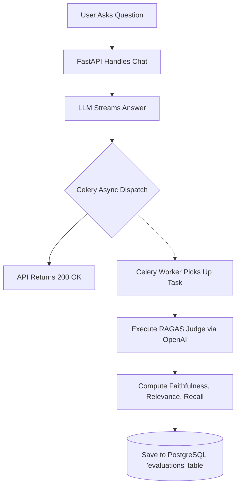

# The Evaluation Pipeline

## 1. Evaluation Philosophy
In standard enterprise software, CI/CD pipelines use unit tests to catch regressions. However, LLMs are stochastic; you cannot assert that `output == "expected_string"`. 

**The fundamental philosophy of ScholarForge AI is that "Vibes are not metrics."** To push an LLM application to production, you must have a deterministic way to mathematically evaluate its non-deterministic outputs. This prevents silent regressions when tweaking prompts or changing embedding models.

## 2. The RAGAS Framework
ScholarForge AI uses **RAGAS (Retrieval Augmented Generation Assessment)**, an industry-standard "LLM-as-a-judge" framework.

Every time the system answers a user's question, the `(Question, Answer, Retrieved Context)` triad is asynchronously dispatched to a Celery worker. The worker uses `gpt-4o-mini` to act as an impartial judge, calculating three vital scores (0.0 to 1.0).

### 2.1 Faithfulness (Hallucination Detection)
*   **Question it answers:** *Did the LLM make something up?*
*   **Logic:** The judge extracts all claims made in the generated answer. It then checks if every single claim can be logically inferred *exclusively* from the retrieved context chunks.
*   **Penalty:** Any claim found in the answer but not in the context drops the score.

### 2.2 Answer Relevance
*   **Question it answers:** *Did the LLM actually answer the user's question?*
*   **Logic:** The judge reads the generated answer and attempts to reverse-engineer the original question. If the reverse-engineered question matches the actual user's query, the score is high.
*   **Penalty:** Tangential, overly verbose, or evasive answers drop the score.

### 2.3 Context Recall
*   **Question it answers:** *Did the retrieval system find all the necessary information?*
*   **Logic:** The judge compares the retrieved context against a "Ground Truth" answer. It checks if the retrieved context contains all the necessary facts to form the ground truth.
*   **Penalty:** If the vector database failed to fetch the paragraph containing the answer, this score drops, signaling a failure in the embedding/BM25 layer, not the LLM.

## 3. Human-in-the-Loop Evaluation (RLHF Foundation)
While LLM-as-a-judge is incredibly fast and scalable, it suffers from inherent biases. To ground the automated RAGAS metrics in reality, ScholarForge implements a **Human Feedback API**.

*   **Mechanism:** Users in the Streamlit UI can Upvote (👍) or Downvote (👎) an assistant's response.
*   **Data Integration:** This `vote` is stored in the `human_feedback` PostgreSQL table via a Foreign Key to the specific `message_id`.
*   **Goal:** By joining the `evaluations` table with the `human_feedback` table, Data Scientists can calculate the correlation coefficient between the RAGAS scores and human preference, ensuring the automated judge actually aligns with user expectations.

## 4. The Automated Evaluation Workflow

## 5. Experiment Tracking & Quality Gates
During development (e.g., when swapping the Cross-Encoder model), the developer runs the pipeline against the **Golden Dataset** (100 predefined academic questions). 

A strict Quality Gate is enforced:
*   If a prompt change drops the Average Context Recall below **80%**, the PR is rejected.
*   If a model swap drops the Average Faithfulness below **87%**, the PR is rejected.

This rigorous, data-driven approach is what separates ScholarForge AI from prototype chatbots.
