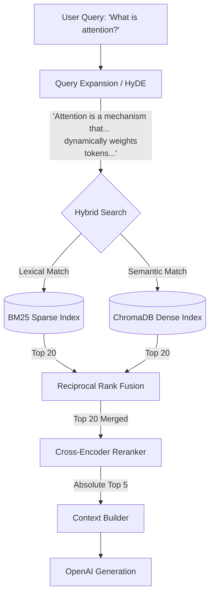

# The Retrieval Pipeline

## 1. Why Advanced Retrieval Matters
In standard RAG tutorials, documents are chunked, embedded, and pushed to a vector database. When a user asks a question, a Cosine Similarity search finds the closest vectors and feeds them to the LLM. 

**This naive approach catastrophically fails in production academic environments:**
*   **The Lexical Gap:** If a user searches for "CRISPR-Cas9", a dense vector search might return documents about "gene editing" that don't actually mention CRISPR, causing the LLM to hallucinate specific details.
*   **The Semantic Gap:** If a user searches for "heart attack", a sparse keyword search (BM25) will completely miss documents that only use the term "myocardial infarction".
*   **The Intent Gap:** Users often ask terse questions like "What is attention?". Searching this short phrase against paragraphs of dense academic text yields poor vector matches due to length mismatch.

ScholarForge AI solves these problems through a **Defense-in-Depth Cascading Retrieval Pipeline**.

## 2. The Retrieval Lifecycle

## 3. Query Expansion (HyDE)
**Problem:** User queries are short; academic chunks are long.
**Solution:** Hypothetical Document Embeddings (HyDE).
Before touching the database, we pass the user's query to a fast, cheap LLM (`gpt-3.5-turbo`) and ask it to write a hypothetical academic paragraph answering the question. 
We then take this "hallucinated" paragraph, concatenate it with the original query, and use *that* massive block of text to search the vector database. Because the hallucinated text contains all the right academic keywords and vector density, recall accuracy skyrockets.

## 4. Hybrid Search Architecture
To solve the Lexical vs Semantic gap, ScholarForge executes two searches concurrently.

### 4.1 Dense Retrieval (ChromaDB)
*   **Model:** `text-embedding-3-small` (OpenAI).
*   **Logic:** Captures the deep semantic meaning of the query.
*   **Output:** Top 20 chunks based on Cosine Similarity distance.

### 4.2 Sparse Retrieval (BM25)
*   **Model:** `rank_bm25`.
*   **Logic:** A highly optimized TF-IDF algorithm that counts exact keyword matches, heavily penalizing stop words (e.g., "the", "and") and rewarding rare academic acronyms.
*   **Output:** Top 20 chunks based on BM25 probabilistic scores.

## 5. Reciprocal Rank Fusion (RRF)
**Problem:** You cannot simply add a BM25 score (which might be `14.5`) to a Cosine Similarity score (which might be `0.82`). They are completely different mathematical scales.
**Solution:** RRF ignores the absolute scores and merges the lists based purely on their *rank* (position in the list).

The formula used in ScholarForge:
$$RRF\_Score(d) = \sum_{q \in Q} \frac{1}{k + rank_q(d)}$$
*(Where $k$ is a smoothing constant, typically 60).*

This ensures that a document which ranks #2 in BM25 and #3 in Vector Search bubbles up to the absolute top of the combined list.

## 6. Cross-Encoder Reranking
**Problem:** The Top 20 chunks from RRF are good, but injecting 20 chunks into an LLM context window is extremely expensive and causes "Lost in the Middle" syndrome (where the LLM forgets context in the middle of the prompt).
**Solution:** `ms-marco-MiniLM` Cross-Encoder.

*   **Bi-Encoders (ChromaDB):** Compress the query into a vector, compress the chunk into a vector, and compare them. It's fast, but loses nuance.
*   **Cross-Encoders:** Feed the query and the chunk *together* into a Transformer classification head simultaneously. The attention heads calculate the exact relationship between every word in the query and every word in the chunk.

The Cross-Encoder re-scores the 20 RRF chunks and passes typically the **Top 5** chunks to the LLM generation layer, heavily increasing relevance without overflowing context.

## 7. Tradeoffs & Future Improvements
*   **Compute Penalty:** The Cross-Encoder adds ~300ms of latency per query. This is a deliberate tradeoff favoring academic accuracy over raw speed.
*   **Future Scope (GraphRAG):** While Hybrid RRF is state-of-the-art for flat documents, future iterations of ScholarForge will integrate Knowledge Graphs (Neo4j) to track complex relationships between different authors and overlapping citations across the corpus.
